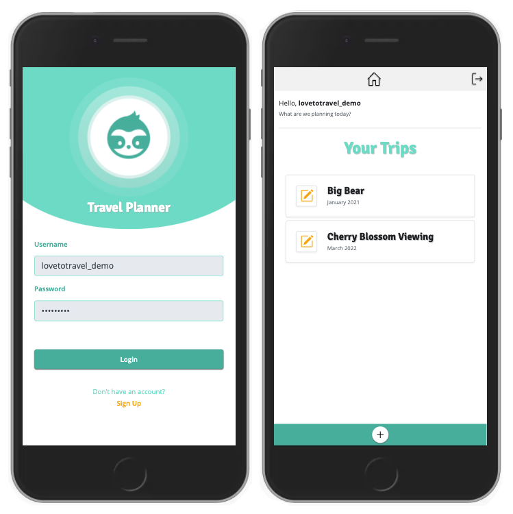
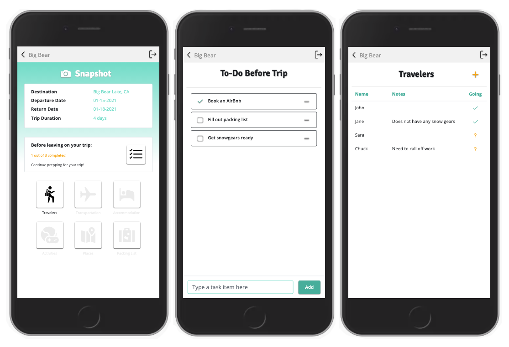

# Travel Planner

## About
Travel Planner is a full stack, CRUD application solo project built with ReactJS. This application is for travel lovers who would like some organization when it comes to planning their trips.

## Live Demo
Try the live demo here: https://travel-planner-lfz.herokuapp.com/

## Technology
* React.js
* Express
* PostgreSQL
* Javascript
* Bootstrap 4
* CSS3
* HTML

## Current Features
* User can add a trip
* User can view a list of planned trips
* User can view the summary of a trip (name, destination, departure date, return date, and trip duration)
* User can add a task to a trip's to-do list
* User can view the to-do list
* User can delete a task item from the to-do list
* User can view how many items are completed from the to-do list on the trip summary page
* User can add a traveler to the trip (name, whether the traveler is attending the trip, and some notes about the traveler)
* User can view the list of travelers

## Preview

## Planned Additions
This application has MANY features to be added. As I am learning more everyday, the UI/UX will be improved on. I also want to add a page where the user is able to see what is planned for the trip based on the day. For example, "On day 'x', this activity is planned or hotel reservation is planned, etc.
* User can put a completed trip in an archive section to be able to refer back to it
* User can delete a trip
* User can create a packing list to check items off
* User can add accommodation information for a trip
* User can add transportation information for a trip
* User can add activities to do
* User can add places to see
* User can make a souvenir list
